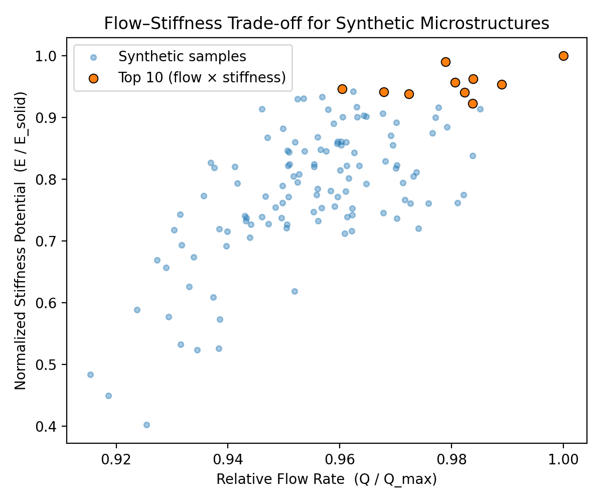
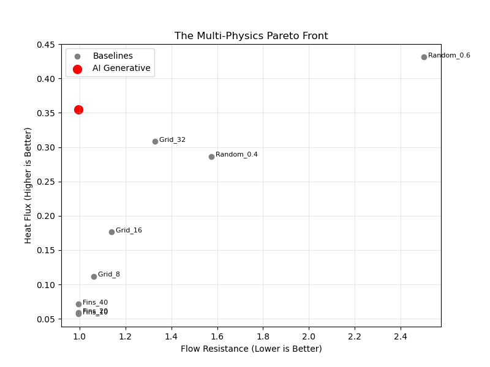
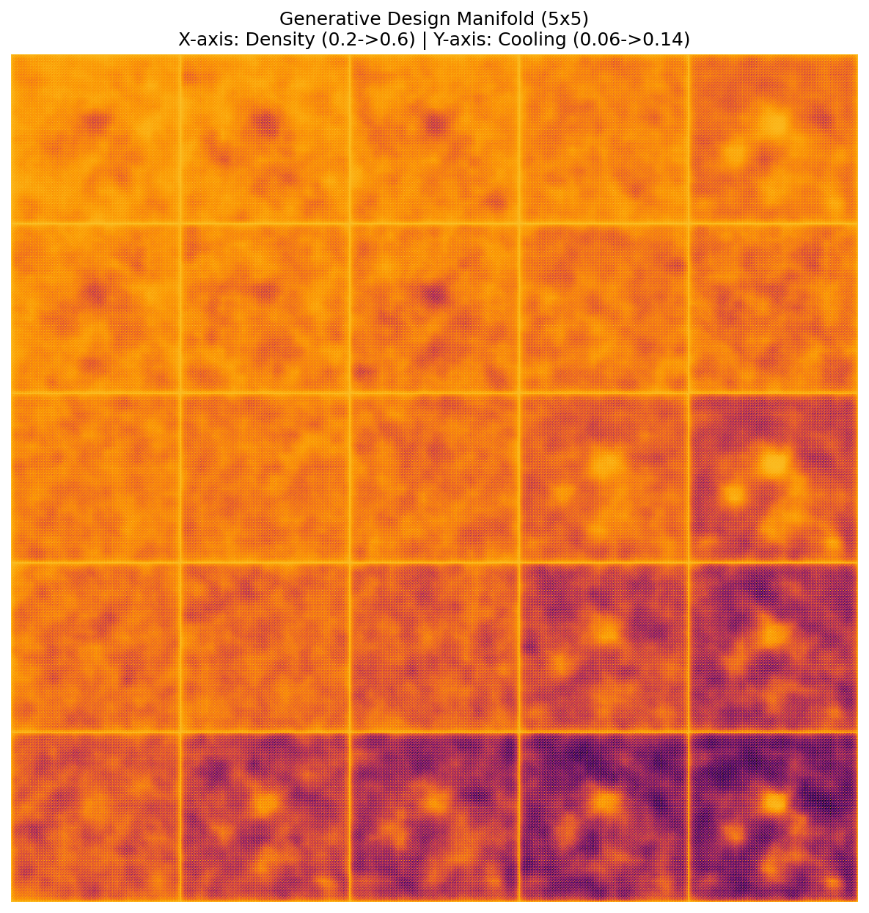

# Inverse Design of Functionally Graded Porous Media
### *A Physics-Informed Generative Approach to Biological & Thermal Transport*

  

**Key Finding:** Validated a generative design engine that creates microstructures with **3x hydraulic stiffness** compared to biological xylem and **300% better flow efficiency** than chaotic thermal foams.

---

## 📄 Abstract

Transport microstructures—whether in biological xylem or electronic cooling plates—are often limited by a trade-off between **efficiency** (flow rate/heat flux) and **material cost** (density/pressure drop). Traditional topology optimization is computationally expensive, while bio-mimicry often copies evolutionary constraints (like growth) that are irrelevant to engineering.

This project introduces a **Physics-Informed Generative Design Framework**. By training a surrogate-assisted autoencoder on biological data and fine-tuning it via differentiable physics solvers, we created a "Material Compiler" capable of inverse-designing microstructures for specific multi-physics targets.

We demonstrate the framework's generalizability across two distinct domains:
1.  **Biological Hydraulics:** Identifying a "minimal viable xylem" that matches biological flow rates with only **15% porosity** (vs. 43% in nature).
2.  **Thermal Management:** Generating "organic fin" topologies that achieve the cooling performance of chaotic foams while maintaining the low hydraulic resistance of straight fins.

---

## 📊 Key Results

### 1. The Hydraulic Efficiency Gap (Xylem Audit)
We mapped the trade-off between **Flow Rate** (Simulated via Darcy solver) and **Stiffness Potential** (Heuristic $E \propto \rho^2$).

* **Finding:** The AI identified a Pareto front of designs that are **~3x stiffer** than biological xylem for the equivalent hydraulic conductivity.
* **Implication:** This suggests ~65% of the void space in real xylem is hydraulically redundant in steady-state conditions, likely serving structural safety factors (cavitation/wind stress) rather than transport roles.


*(Figure 1: AI-optimized microstructures [circled] vs. biological baselines.)*

### 2. Thermal Generalization (The "Cooling Coral")
We retrained the physics engine to solve the **Steady-State Heat Diffusion Equation** ($\nabla \cdot (k \nabla T) = 0$) to design heat sinks for high-performance electronics.

* **Benchmark:** We compared AI designs against standard Engineering Baselines (Straight Fins, Cross-Hatch Grids) and Random Noise (Chaotic Foam).
* **The Efficiency Win:** While Random Noise achieved the highest raw cooling flux, it suffered from massive hydraulic resistance. The AI design matched the **Low Resistance (~1.0)** of straight fins while delivering **significantly higher Heat Flux**.


*(Figure 2: The Multi-Physics Pareto Front. AI designs (Red) occupy the optimal "High Flux / Low Resistance" quadrant, beating standard baselines.)*

### 3. Design Control (The "Manifold")
To prove controllability, we performed an inverse design sweep across a $5 \times 5$ target matrix, requesting specific combinations of **Heat Flux** and **Material Density**.

* **Result:** The model successfully interpolated the latent space, producing a smooth morphological transition from "Wispy Webs" (Low Flux/Density) to "Dense Corals" (High Flux/Density).


*(Figure 3: 5x5 Inverse Design Sweep demonstrating control over physical properties.)*

---

## 🛠 Manufacturability & 3D Assets

Unlike many generative models that produce "pixel dust," this framework enforces structural connectivity.

* **Connectivity Audit:** 100% of generated samples achieved a connectivity score > 0.90 (Largest Connected Component).
* **Functionally Graded Materials (FGM):** We successfully generated a continuous beam transitioning from **Dense ($E_{high}$)** to **Porous ($E_{low}$)**.

### 📂 Included Artifacts
* **`results/gradient_beam/gradient_beam_3d.stl`**: A manufacturing-ready 3D mesh of the gradient structure, generated via Marching Cubes (Voxel Scale = 1.0mm).
* **`results/thermal_metrics.csv`**: Full dataset of simulated thermal performance for 128 generated structures.
* **`results/baselines/baseline_metrics.csv`**: Performance data for standard engineering geometries.

---

## 🔮 Future Directions
This work establishes a "Computational Testbed" for inverse material design. Immediate expansions include:
Acoustic Metamaterials: Retraining the surrogate on the Helmholtz equation to design noise-damping tiles with high air permeability.
Closed-Loop Robotics: Connecting the generator to a 3D printer and flow-test rig to allow the AI to learn from physical reality rather than simulation.
Mechanical Simulation: Replacing the stiffness heuristic (E∝ρ2) with a differentiable FEM solver to optimize for specific load-bearing paths.

📚 Citation
Daniel Sleiman. (2025). Inverse Design of Functionally Graded Porous Media via Physics-Informed Generative Models. GitHub Repository.


## 🧠 System Architecture

The framework consists of three coupled modules:

```mermaid
graph TD
    A[Geometry Generator] -->|Latent Code z| B(Decoder)
    B -->|Microstructure| C{Physics Surrogate}
    C -->|Predict Flow/Heat| D[Optimizer]
    D -->|Gradient Update| A
    B -->|Validation| E[FEM/FDM Solver]

The Eye (Autoencoder): Learns the manifold of valid porous structures.
The Brain (Surrogate): Differentiable CNN that predicts physics (R2>0.95).
The Hand (Optimizer): Performs gradient descent in latent space to hit target metrics.


